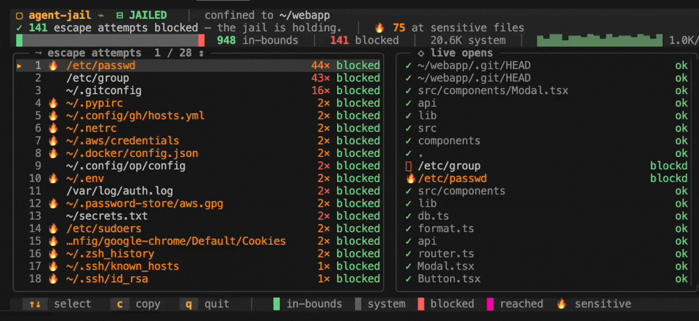

# `agent-jail`

> **A cell for your coding agent.** The kernel decides what it can touch, and you watch it try.

<p align="center">
  
  
  
  
  <a href="https://discord.gg/dYZu9PjKB"></a>
</p>



**`agent-jail` confines a coding agent (`omp`) and every process it spawns to one directory with the Linux Landlock LSM, and shows each file it opens, live, over eBPF.**

> [!TIP]
> The enforcement and the watching are two separate kernel mechanisms aimed at the same process. Landlock applies the cage before the agent starts, so the restriction is inherited across `exec` and cannot be lifted from inside. eBPF reads every open and its return value, so you see the verdict the kernel actually returned, not a guess.

> [!WARNING]
> **Experimental (v0.x).** The confinement holds against a breakout self-test at zero leaks, but it has only been verified on one kernel and architecture (Linux 6.12, arm64, Debian 13) against a shell stand-in, not against real `omp` across the environments people run. Treat it as a layer to evaluate and harden, not a sole barrier you bet secrets on.

## Quick start

```sh
curl -fsSL https://yeet.cx | sh
git clone https://github.com/yeet-src/agent-jail.git && cd agent-jail
make                                  # builds the BPF object, the launcher, and the JS bundle
sudo ./scripts/agent-jail ~/project   # jail omp in ~/project and watch it live
```
<sub>[Manual install guide](https://yeet.cx/docs/install/manual-installation) | Linux only</sub>

`agent-jail` carries a compiled launcher and a wrapper script, so it builds from source rather than running straight from a remote `yeet run`. The dashboard runs in your terminal with `omp` jailed underneath it. `↑` / `↓` moves the highlighted row in the escape list, `c` copies a session summary, `q` quits. `--headless` drops the TUI and streams escape reports for a background run.

## A 60-second primer on jailing a process

A coding agent runs with your user's full filesystem access, and it decides what to read on its own. Confining it means letting the kernel, not the agent, decide which paths are reachable. Two kernel features do the work.

| Term | What it means here |
|---|---|
| **Landlock** | A Linux Security Module, mainline since 5.13, that lets an unprivileged process drop its own filesystem access. No root, no container, no namespaces. |
| **ruleset** | The set of paths the jailed process keeps: read and write under the project directory, read-only on the system paths a program needs to start. Everything else is denied. |
| **inherited restriction** | The ruleset is applied before `omp` starts and survives `exec`, so every child it spawns (`git`, `node`, `cat`) is bound by it too, and none of them can undo it. |
| **escape attempt** | An open of a path outside the project directory. The kernel refuses it; the watcher records it with the kernel's error code. |
| **reached** | An out-of-bounds open that succeeded. Under a working jail this stays zero; you see it only in `--audit` mode, which runs the agent unconfined. |

The reason a path filter built this way holds: Landlock checks the resolved inode, not the path string you passed. A `../../etc/passwd`, a symlink pointing out of the directory, and the `/proc/self/root` re-entry trick all resolve to the same forbidden file, and all three are refused.

## Common use cases

Developers running an AI coding agent on a real codebase, and anyone auditing what an agent does to the filesystem before trusting it. Where you'd otherwise wrap the agent in a container or a VM to keep it away from `~/.ssh`, `agent-jail` applies a kernel ruleset to the process directly, with no image to build and no guest to boot.

- Running `omp` on a work repo. Will it stay out of `~/.ssh` and `~/.aws`?
- Evaluating a new agent. What does it reach for outside the project?
- Recording a sandbox demo. Can you show the kernel blocking an escape on camera?
- Running an agent unattended. What tried to leave the directory while you were away?

## What you're looking at

A status masthead on top, two framed panels, and a key-hint footer.

**Masthead.** The jail state (`JAILED` or `AUDIT`), the directory, a one-line verdict (`37 escape attempts blocked`), and a bar splitting every open into in-bounds, system, blocked, and reached, with a live access-rate sparkline. The split is the proof: in-bounds work and blocked escapes are counted from the same stream.

**Escape attempts.** The paths `omp` reached for outside the directory, ranked by how often. Sensitive targets (keys, credentials, shell history) are flagged with a 🔥. The badge on the right is the kernel's verdict: `blocked` means the open was refused, `reached` means it got through (which only happens in audit mode). `↑` / `↓` moves a highlighted cursor down the list as it grows.

**Live opens.** The stream of recent opens as they happen: in-bounds work in green, interleaved with the occasional blocked escape, each attributed to the child process that made the call (`cat`, `git`, `grep`), since the jail covers the whole process tree.

Benign system and scratch reads (`/usr`, `/lib`, `/tmp`) are counted as "system" and kept off the escape list, so a real reach at your data is not buried under library and locale lookups.

## How it works

The launcher enforces; the eBPF programs observe. They share nothing but the process they are aimed at.

**The launcher** (`src/jail/agent-jail.c`). A dependency-free C program that calls three Landlock syscalls (`landlock_create_ruleset`, `landlock_add_rule`, `landlock_restrict_self`), then `execve`s the target. It grants read and write under the project directory, read-only on the system directories a program needs to run, the specific `/etc` loader files, and the command's own binary, then locks itself before exec. It also strips environment variables whose names look secret-bearing (`KEY`, `TOKEN`, `SECRET`, `AWS_`, and similar), because Landlock cannot stop a process reading its own environment.

**The BPF side.** One object, four tracepoint programs, one ring buffer. Each open event carries the path, the return value, and the comm of the process that made it.

| Program | Hook | Captures |
|---|---|---|
| tracepoint | `sys_enter_openat` / `sys_exit_openat`, and the `openat2` pair | Every file open and the kernel's return value (the verdict) |
| tracepoint | `sched_process_fork` | New children, recorded into the traced-process set |
| tracepoint | `sched_process_exit` | Process exit, to drop it from the set |

A `traced` hash map seeded on `omp` and extended at each fork is how an open by a child like `cat` is attributed to the jailed tree rather than missed. The send path stages each path in a per-CPU scratch map and a per-thread `inflight` map, then emits one `file_event` struct into the ring buffer.

**The JS side.**

- `src/probes/` is the only BPF-aware code. It loads the object, subscribes to the ring buffer once, and rolls the stream into reactive signals.
- `src/components/` and `src/lib/` are pure presentation reading those signals: the masthead, the two panels, the path classifier, the theme.
- `src/main.jsx` wires them together and owns keyboard input.

## Requirements

> [!IMPORTANT]
> A kernel with Landlock enabled (`CONFIG_SECURITY_LANDLOCK=y`) for the jail, and BTF (`CONFIG_DEBUG_INFO_BTF=y`) for the eBPF watcher. Both are on by default on current Ubuntu, Debian, and Fedora. Landlock is mainline from kernel 5.13.

The yeet daemon, which handles the privileged BPF load. `curl -fsSL https://yeet.cx | sh` installs it.

## Honest caveats

> [!NOTE]
> What `agent-jail` does not do, and where it is unproven.

- It confines the filesystem, not the network. Landlock governs files, not sockets, so the agent's calls to model APIs keep working and network exfiltration is not prevented. For that, pair it with a network namespace or firewall.
- It is verified on one kernel and architecture against a shell stand-in, not against real `omp` across distros and kernel versions. The Landlock ABI gained rights across 5.13 to 6.x, so an older kernel grants a narrower ruleset.
- `--best-effort` runs the agent unconfined when Landlock is unavailable. That is deliberate, so a missing LSM does not silently break the run, but it means no protection on that host. Without the flag the launcher refuses rather than give false safety.
- Environment secrets are scrubbed by name before exec, so a secret passed under an unrecognised variable name still reaches the agent. Prefer giving a jailed agent its key through a config file inside the directory.
- It reads paths and the kernel's verdict, not file contents. It tells you what was reached for, not what was in it.

## Community questions

**Do I need a container or a VM?**
No. `agent-jail` applies a Landlock ruleset to the process itself, with no image and no guest OS. The agent runs as a normal process that happens to wake up already confined.

**Will the jail break the tools `omp` runs?**
Tools that stay inside the project work normally. A child that reaches outside (a `git` reading `~/.gitconfig`, say) is refused like any other escape, because the ruleset is inherited across `exec`. Grant an extra path with `--allow` if a tool legitimately needs one.

**Why don't I see any escape attempts?**
Because a working jail produces none beyond startup, and the watcher hides benign system and scratch reads. Run `--audit` to see what the agent reaches for with the jail off.

**Is it safe to run against real work?**
The enforcement is the Landlock kernel API, and the watcher is passive. It reads file paths and verdicts, so treat its output like any tool that can see filesystem metadata. It is experimental, so do not rely on it as your only barrier yet.

**How is this different from running the agent in Docker?**
A container isolates with namespaces and a separate filesystem view; `agent-jail` leaves the agent in your filesystem and lets the kernel refuse the paths outside one directory. No image build, no volume mounts, and the eBPF view shows you each refusal as it happens.

## Building from source

```sh
make            # clang + bpftool build the BPF object, cc builds the launcher, esbuild bundles the JS
make adversary  # build, then run the breakout self-test (must report 0 leaks)
make clean
```

Needs `clang`, `bpftool`, and a C compiler for the BPF object and the launcher, plus `node` and `npm` for the bundle step. The compiled BPF object, the launcher binary, and the bundled JS are gitignored; `make` regenerates them.

## License

The BPF program declares `SEC("license") = "Dual BSD/GPL"`, required because it uses GPL-only kernel helpers. No repository-wide LICENSE file is present.

---

Built with [yeet](https://yeet.cx/docs/?utm_source=github&utm_medium=readme&utm_campaign=agent-jail), a JS runtime for writing eBPF programs on Linux machines. Join us on [discord](https://discord.gg/dYZu9PjKB?utm_source=github&utm_medium=readme&utm_campaign=agent-jail).
